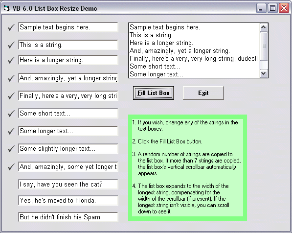

<div align="center">

## Listbox resize demo


</div>

### Description

This demo shows how to control the width of a standard list box's text area so its widest string is always visible.

VB's list box control automatically adds a vertical scrollbar when there are too many items to show vertically. The demo detects the vertical scrollbar and includes it in the list box's width.
 
### More Info
 
(n/a)

A desire to do more coding, maybe...? :?)


<span>             |<span>
---                |---
**Submitted On**   |2003-10-28 00:54:52
**By**             |[Andy Fielding](https://github.com/Planet-Source-Code/PSCIndex/blob/master/ByAuthor/andy-fielding.md)
**Level**          |Intermediate
**User Rating**    |5.0 (10 globes from 2 users)
**Compatibility**  |VB 6\.0
**Category**       |[Windows API Call/ Explanation](https://github.com/Planet-Source-Code/PSCIndex/blob/master/ByCategory/windows-api-call-explanation__1-39.md)
**World**          |[Visual Basic](https://github.com/Planet-Source-Code/PSCIndex/blob/master/ByWorld/visual-basic.md)
**Archive File**   |[Listbox\_re16639610282003\.zip](https://github.com/Planet-Source-Code/andy-fielding-listbox-resize-demo__1-49315/archive/master.zip)

### API Declarations

```
1. GetSystemMetrics (determines user's scrollbar size)
2. GetWindowLong (determines if listbox currently has a scrollbar)
```


